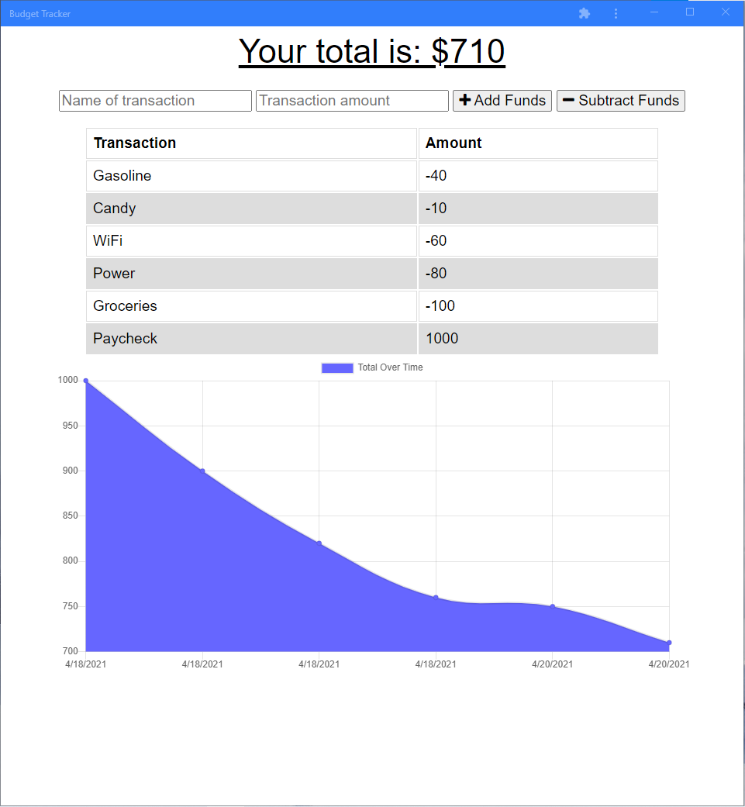

# Expense Log
  
  ## Description
  Budget tracker that allows for offline access and functionality.

  This is a Progressive Web App (PWA) that uses a manifest, a service worker, and a static cache to deliver an offline experience. It uses IndexedDB to save transactions when the application is offline.

  Deployed at [Heroku](https://immense-dusk-50390.herokuapp.com/).

  See the repo at [GitHub](https://github.com/danielryangreen/expense-log).

  
  ## Table of Contents
  * [Installation](#installation)
  * [Usage](#usage)
  * [Credits](#credits)
  * [License](#license)
  * [Contributing](#contributing)
  * [Tests](#tests)
  * [Questions](#questions)
  ## Installation
  Download and install MongoDB Community Server. Mongoose will create the schema when the application runs for the first time.
  
  To install required packages, enter `npm i` in the terminal.
  ## Usage
  To run the application, enter `node server.js` in the terminal and then navigate to `localhost:3000` in the browser.

  To see the offline functionality, open the link above for the deployed app and put your device in airplane mode. You should be able to enter transactions normally, and they will sync with the database when the device is back online.
  ## Credits
  The following resources were used in this project:

  - [MongoDB](https://www.mongodb.com/2)
  - [Mongoose](https://mongoosejs.com/)
  - [Node.js](https://nodejs.org/en/)
  - [Express](https://expressjs.com/)

  Starter code was provided by [Trilogy Education Services](https://trilogyed.com/).
  ## License
  This project is covered under the MIT license.
  ## Contributing
  Please submit a pull request.
  ## Tests
  Not provided.
  ## Questions
  Please contact me at dan.ryan.green@gmail.com. See my work on GitHub at [danielryangreen](https://github.com/danielryangreen/).
